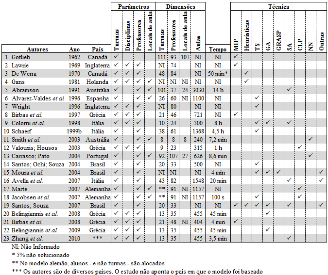
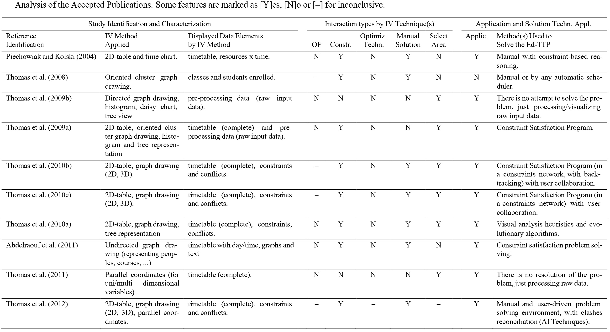

# TCC

<!-- \chapter{Contexto acadêmico do \textit{Timetabling Problem}} -->

## 2. Contexto do *Timetabling Problem* no meio acadêmico

Antes de prosseguirmos com o desenrolar deste trabalho, é adequado que primeiro definamos alguns parâmetros para o melhor entendimento do que está por vir.

<!-- \section{Definição de termos} -->

### 2.1 Definição de termos

Ao longo dos anos de desenvolvimento acadêmico, diversos assuntos vão se aprofundando e se tornando mais específicos, assim, os estudiosos acabam cunhando novos termos que o auxiliam a desvencilhar as novas áreas específicas das suas áreas originárias. Porém, existe o potencial de que haja um crescimento desestruturado destes novos termos, assim vários termos diferentes podem se referir a um mesmo conceito, enquanto que um mesmo tempo pode se referir a vários conceitos diferentes de acordo com o autor.

Assim como feito por \cite{goos_scheduling_1996}, definiremos os conceitos dos termos que serão usados ao longo deste trabalho.

O termo "\textit{timetable}" tem o mesmo valor que "grade horária" e serão usadas como se fossem sinônimos mesmo sendo de línguas diferentes. Segundo \cite{goos_scheduling_1996}, podemos definir \textit{timetable} como uma estrutura que mostra quando que eventos ocorrerão, não havendo necessariamente a alocação de recursos.

Vale ressaltar que este termo não tem seu uso limitado para os fins desta pesquisa, sendo também usado para problemas de alocação de enfermeiros, esportes, funcionários e transportes \cite{arratia-martinez_university_2021}. Entretanto, neste trabalho, abordaremos principalmente os termos relacionados ao que pode ser chamado de \textit{Educational Timetabling} (Ed-TT) \cite{alencar_visualization_2019}, que é o que tende a envolver um conjunto específico de recursos relacionados à educação.

Wren também define os conceitos para \textit{class timetable}, \textit{university examination timetable} e \textit{university class timetable}, tendo relevância apenas o último, que considera a disponibilidade de professores e salas, a quantidade de alunos e os requisitos que determinada disciplina exige.

Exemplo: Enquanto que a disciplina "Laboratório de Física" exige que a aula seja ministrada em um tipo de sala específica com os equipamentos necessários, a disciplina "computação e sociedade" não apresenta esta restrição, ficando limitada apenas à quantidade de pessoas na turma.

Aqui, visto que uma solução final envolverá várias dimensões (Professores x Disciplinas x Sala x Alunos x Horários x Dias), consideraremos \textit{timetable} como esse pacote de valores distribuídos em uma só estrutura. Para que esses valores sejam distribuídos, daremos o nome de \textbf{alocação} ao ato de criar qualquer relação entre as dimensões. Como a relação de horários e dias será considerada fixa, a \textbf{alocação} se referirá à atribuição como a de professores a disciplinas, disciplinas a salas, disciplinas a um determinado padrão de dias e horários, etc.

Para que esta alocação ocorra, é necessário atender a certos critérios, e aí entra o "problema de organização de grade horária", também chamado de \textit{timetabling problem}. Esta é uma subcategoria do \textbf{problema de agendamento} (\textit{scheduling Optimization Problem}) \cite{alencar_visualization_2019} que por sua vez é definido por \cite{goos_scheduling_1996} como sendo:

<!--
\begin{quote}\footnotesize
    Resolver problemas práticos relacionados à alocação, sujeito a restrições, de recursos a objetos sendo colocados no espaço-tempo, usando ou desenvolvendo quaisquer ferramentas que possam ser apropriadas. Os problemas irão frequentemente se relacionar à satisfação de certos objetivos.
\end{quote}
-->
> Resolver problemas práticos relacionados à alocação, sujeito a restrições, de recursos a objetos sendo colocados no espaço-tempo, usando ou desenvolvendo quaisquer ferramentas que possam ser apropriadas. Os problemas irão frequentemente se relacionar à satisfação de certos objetivos.

Outro termo relevante a se pontuar são as \textit{hard and soft constraints} que podemos chamar de restrições rígidas e flexíveis. \cite{alencar_visualization_2019} as define dizendo que as restrições rígidas são de atendimento obrigatório, enquanto as restrições flexíveis são opcionais, mas convenientes para melhorar a qualidade da solução obtida.

Exemplo de restrição rígida: nem professores nem alunos podem ser alocados simultaneamente a duas salas ou disciplinas simultaneamente. Uma solução que viole esta restrição se torna automaticamente inviável.

Exemplo de restrição flexível: professor J. prefere não dar aulas nas tardes de sexta-feira, e prefere dar aula nas manhãs da segunda-feira. Uma solução que viole esta restrição não se torna inviável, porém tende a ter menos valor neste critério do que uma solução que siga as preferências definidas.

Alguns outros termos similares a este campo de pesquisa encontrados na literatura são \textit{periodic event scheduling problem}, \textit{timetable scheduling}, \textit{class scheduling}, \textit{student scheduling}, \textit{university course timetabling}, dentre outros.

<!--
\section{Métodos de resolução}
-->

### 2.2. Métodos de resolução

<!--
% - O problema de timetabling   a
%   - Origem                    a
%   - Repartições               a
%   - Escopo maior              a
%     - Scheduling              a
%   - Escopo menor              a
%     - Exam                    a
%     - Class                   a
% - TT
%   - Soluções
%   - Desafios
%   - Diversas formas de resolução
%     - Graph Coloring
%     - Heurísticas
%     - Meta-heurísticas
%     - IA
%     - etc.
% - Visualização de informações
%   - Benefícios
%   - Motivações
%   - Relação com timetabling
% - Problema geral a ser resolvido
%   - Multi dimensionalidade
%     - Professores
%     - Alunos
%     - Salas
%     - Departamentos
%       - Preferências
%       - Concorrências
%   - Otimalidade
%   - Erros humanos
%   - Número de possibilidades
%   - Interface intuitiva e relevante é um desafio com poucos estudos nos últimos anos
% - Problemas específicos
%   - Regras específicas
%   - Prioridades diferentes
%   - estrutura organizacional semi-exclusiva
-->

<!--
% Pesquisar posteriormente sobre imagens que ilustrem bem as diferentes sub categorias de scheduling
-->

Existem diversas implementações já realizadas, utilizando uma miríade de métodos. Em seu trabalho \cite{miranda_udpskeduler_2012}, J. Miranda informa sobre diversos sistemas baseados em computador para auxiliar na tarefa de agendamento. J. Miranda também cita um dos métodos de resolução como sendo o \textbf{modelo de programação inteira} e \textbf{heurísticas}.

Outros trabalhos buscaram condensar em forma de tabela as informações encontradas. Abaixo estão dispostas algumas das tabelas encontradas durante o estudo bibliográfico e que foram elaboradas por diversos autores.

Na figura \ref{Desenvolvimento}, \cite{alegre_desenvolvimento_2012} traça a relação entre os diversos autores, ano de sua publicação e seu país de origem com os dados encontrados em seus trabalhos quanto aos parâmetros utilizados na elaboração da grade horária, quão grandes eram cada um de seus parâmetros, quanto tempo foi necessário para achar uma solução e quais foram as técnicas utilizadas.

% Entender o que tá dando errado aqui depois

<!--
\begin{figure}[htbp]\centering
    \caption{\label{Desenvolvimento}Resumo de trabalhos, parâmetros, dimensões, tempo e técnicas.}
    \includegraphics[angle=0,scale=1]{files/img/tabelas/Desenvolvimento.png}
    \legend{Fonte: \cite{alegre_desenvolvimento_2012}}
\end{figure}    % Desenvolvimento
-->

Na figura \ref{University}, \cite{arratia-martinez_university_2021}, apresenta uma comparação similar à anterior, porém não separada em categorias, apenas categorizando entre verdadeiro e falso algumas características como alocação de salas, professores, nível institucional e método exato ou inexato.

<!--
\begin{figure}[htbp]\centering
    \caption{\label{University}Comparação entre artigos que solucionam o problema de grade horária}
    \includegraphics[angle=0,scale=0.37]{files/img/tabelas/University.png}
    \legend{Fonte: \cite{arratia-martinez_university_2021} - editado}
\end{figure}    % University
-->

Na figura \ref{Visualization}, \cite{alencar_visualization_2019} explora uma categoria mais específica do problema, que é a característica da interatividade das interfaces desenvolvidas. Este apresenta características qualitativas quanto aos métodos, os dados dispostos, as técnicas de interação e o método utilizado para solucionar o problema de grade horária educacional. Nesta figura, os autores usam "Y" para simbolizar "Sim", "N" para "Não" e "-" para "Inconclusivo".

<!--
\begin{figure}[htbp]\centering
    \caption{\label{Visualization}Análise de publicações aceitas.}
    \includegraphics[angle=0,scale=0.7]{files/img/tabelas/Visualization.png}
    \legend{Fonte: \cite{alencar_visualization_2019} - editado}
\end{figure}    % Visualization
-->

<!--
\section{Desafios recorrentes}
-->

### 2.3. Desafios recorrentes

Apesar da vasta quantidade de trabalhos realizados com este fim, o \textit{Timetabling Problem} segue sendo uma área sem uma solução definitiva.

Tomáš Müller \cite{burke_modeling_2007} traz a questão da modelagem como um dos maiores obstáculos. À medida em que a complexidade aumenta, se torna cada vez mais difícil desenvolver uma solução efetiva. Assim fazendo com que a solução para uma universidade possa não ter utilidade para outras, ou até mesmo não seja capaz de lidar com todos os problemas de uma mesma universidade.

Apesar do contrafluxo encontrado na resolução desse problema, Tomáš cita que, apesar da complexidade, é sim possível desenvolver soluções que tenham uso prático, mesmo que não seja um processo fácil. As ferramentas existem e estão disponíveis. Restando então considerar e resolver as preocupações dos usuários às questões, visto que as técnicas de resolução já se encontram vastamente documentados.

Com isso, entramos também no ramo da Interação Homem-Máquina, ramo abordado por Dinata \cite{andre_interaction_2018} que visou em seu desenvolvimento a criação de uma interface focada no usuário. Assim minimizando o atrito na abordagem desse problema complexo. Também sendo área de enfoque de \cite{alencar_visualization_2019} em sua revisão literária

<!--
% ### 2.5. Contexto histórico e origem

% - Como surgiu essa área? Em que momento ela se dividiu? Devo falar sobre isso?

% ### 2.6. Técnicas existentes(?)

% - Falar sobre técnicas existentes e quem já fez. Tipo o que aquele artigo sem DOI fez
-->
