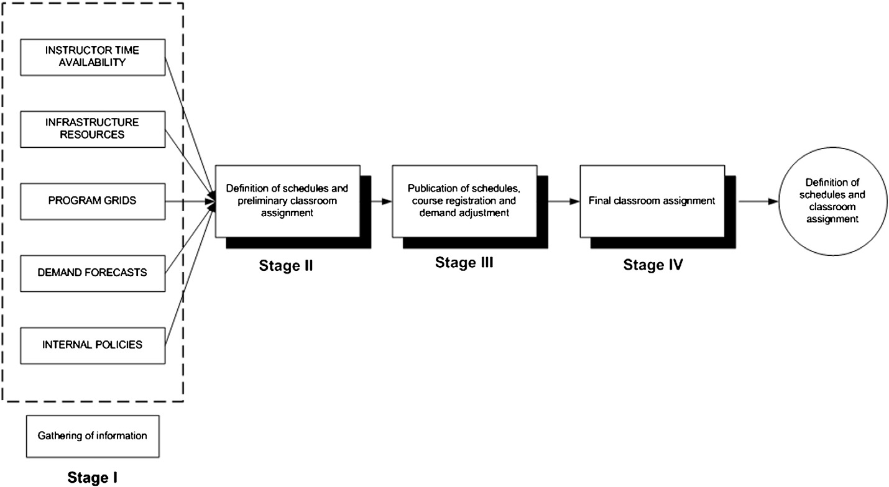

# TCC

<!--
\chapter{Modelagem geral do sistema}
-->

## 2. Modelagem geral do sistema

Tendo esclarecido sobre as questões gerais do trabalho e da área de estudo. Agora nos aprofundaremos um pouco mais na modelagem e criação de diagramas que ilustrem o funcionamento geral do sistema e a forma como se dará a execução da metodologia proposta.

<!--
\section{Estágios de execução}
-->

### 2.1 Estágios de execução

Em seu trabalho de aplicação prática, \cite{miranda_udpskeduler_2012} estruturou estágios que compõem o processo necessário para que enfim se alcance a definição de \textit{timetables} ótimas.

<!--
\begin{figure}[htbp]\centering
    \caption{\label{fig:geral} Estágios para a obtenção de grade horária ótima}
    \includegraphics[scale=0.5]{files/img/Arquitetura/Arquitetura-UDP.png}
    \legend{Fonte: \cite{miranda_udpskeduler_2012}}
\end{figure}
-->

Na Figura \ref{fig:geral}, estão dispostos 4 estágios principais. O primeiro dispõe da aquisição de informações. O meio de aquisição não é relevante para o momento atual, apenas considera-se que esta informação será obtida. No segundo estágios são definidas grades horárias preliminares para se atribuir os alunos. No terceiro, os alunos se inscrevem e a demanda é ajustada, por fim, no quarto estágio, ocorre a alocação final das salas.

<!--
\section{Iteração}
-->

### 2.2 Iteração

Para se alcançar uma alta satisfação por parte dos \textit{stakeholders}, vê-se necessária a constante interação com os mesmos. Para isto, será seguida a estrutura utilizada por \cite{andre_interaction_2018}.

<!--
\begin{figure}[htbp]\centering
    \caption{\label{fig:IxD} Etapas do Design de Interação}
    \includegraphics[scale=1]{files/img/Arquitetura/Arquitetura-IxD.png}
    \legend{Fonte: o autor}
\end{figure}    % University
-->

Seguindo o conceito do Design de Interação, a Figura \ref{fig:IxD} ilustra o ciclo de ações a serem tomadas durante o desenvolvimento do sistema, caso este venha a ser necessário. Neste modelo de pesquisa, os \textit{stakeholders} serão consultados continuamente enquanto lhes é apresentado protótipos do sistema, para que assim informem quanto às suas percepções. Esta dinâmica tem como finalidade encontrar um design tal que seja adequado aos desejos e necessidades de seus usuários finais.

<!--
\section{Funcionamento}
-->

### 2.3 Funcionamento

O sistema final seguirá uma dinâmica similar à que foi ilustrada por \cite{bebis_information_2019} em seu trabalho sobre o uso da Visualização de Informações em relação às Ed-TTPs.

<!--
\begin{figure}[htbp]\centering
    \caption{\label{fig:sistema} Funcionamento geral do sistema}
    \includegraphics[scale=0.6]{files/img/Arquitetura/Arquitetura_bebis_information_2019.png}
    \legend{Fonte: \cite{bebis_information_2019}}
\end{figure}
-->

A Figura \ref{fig:sistema} apresenta o comportamento geral do sistema, como seus diferentes segmentos interagem entre si e de que forma o usuário interage com o mesmo. O usuário poderá ajustar os objetivos da otimização e suas restrições, elas serão utilizadas nos métodos de otimização. Estes métodos serão utilizados para se alcançar soluções para estes critérios, as melhores serão então armazenadas. Em posso destes dados, a aplicação apresentará visualmente estas informações ao usuário, permitindo que ele interaja dinamicamente a fim de alcançar seus objetivos.
